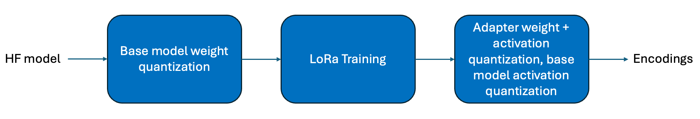

.. _featureguide-qw-lora:

######################
QW-LoRa
######################

Context
=======

The QWA-LoRa workflow involves determining the appropriate weight encodings for the base model before
performing some epochs of LoRa training. Finally, the activation encodings for the base model; and weight and
activation encodings for the updated LoRa layers are calibrated. This is expressed in the block diagram below.

This workflow is especially useful if you have precomputed encodings for the weights of your model (using any technique)
and applied those encodings to your model (so that the model parameters have already been updated).

Workflow
========