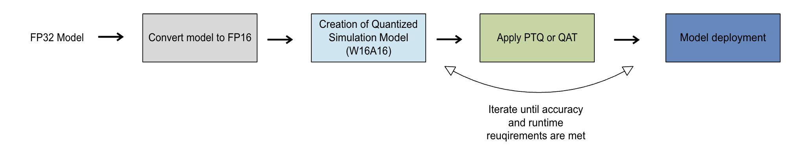

.. include:: ../abbreviation.txt

.. _opt-guide-quantization-workflow:

#####################
Quantization workflow
#####################

This page outlines a methodology to onboard, quantize, and deploy machine-learning models on Qualcomm\ |reg| devices using the AI Model Efficiency Toolkit (AIMET).

Supported precisions for on-target inference
============================================

Before applying quantization techniques, identify the computational precisions supported by the target runtimes
on which you plan to run inference. For weights and activations, the precisions supported by AIMET are: FP32, FP16, INT16, INT8, and INT4.

Some recent runtimes also support *heterogeneous bit-width* (also called *mixed precision*), enabling you to run
sensitive operations at a higher precision within your model.

Precisions supported by AIMET for inference on target runtimes like |qnn|_ are:

.. list-table::
   :widths: 12 8 8
   :header-rows: 1

   * - Precision format
     - Weights
     - Activations
   * - Floating-point (No quantization)
     - FP16
     - FP16
   * - Integer (quantized W8A16)
     - INT8
     - INT16
   * - Integer (quantized W8A8)
     - INT8
     - INT8
   * - Integer (quantized W4A8)
     - INT4
     - INT8

Quantization workflow
=====================

The following sections represent a recommended workflow for quantizing a model to improve its efficiency. Unless you have a reason to do otherwise, we recommend you proceed with these steps in order.

1. Simulating a quantized model
-------------------------------

We recommend using Quantization simulation (QuantSim) to simulate your quantized model and compute baseline accuracy. See the :doc:`../quantsim/index`.

2. Selecting on-target metrics
------------------------------

Once you have achieved acceptable off-target quantized accuracy using QuantSim, consider the following
on-target metrics. Decide which are important to your application:

- Latency
- Memory size

If goals for either of the on-target metrics are not met for your use case, consider lowering the model's precision.
To decide which precision to use for inference on target runtimes, start with the highest available precision (For example FP16) and test descending precisions if necessary. Each decrease in precision requires additional engineering effort, including model evaluation and training.

The figure below illustrates the recommended quantization workflow and the steps required to deploy the quantized model on the target device.

   Recommended quantization workflow

The following sections describe the these processes.

3. Trying FP16 precision (No quantization)
------------------------------------------

We recommend that you start by converting an FP32 model to FP16 precision without quantization. For details on how to compile FP16 models for target runtimes, see |qnn_docs|_ or |qai_hub_docs|_.

4. Verifying W16A16 quantization
--------------------------------

Before using a quantized integer format, ensure that the FP32 model and the quantized model (QuantSim object) perform similarly during the forward pass, especially when custom quantizers are included in the model.

.. note::

  Ensure that the FP32 model adheres to model-specific guidelines. For instance, in PyTorch QuantSim can only quantize math operations performed by :class:`torch.nn.Module` objects, while :class:`torch.nn.functional` calls will be incorrectly ignored. Refer to framework-specific pages to learn more about such model guidelines.

Once the model conforms to guidelines, create a QuantSim with the bit-width set to 16 bits for both weights and activations (W16A16). 

Then, obtain the off-target quantized accuracy metric for the quantized model and verify that it agrees with the FP32 model. If it does not, you can help improve AIMET by reporting an issue to |aimet|_.

5. Applying PTQ or QAT
----------------------

If any of the metrics are not acceptable with higher precision, begin with weights at INT8 precision and activations at INT16 precision. 

If the off-target quantized accuracy metric does not meet expectations, use PTQ or QAT techniques to improve the quantized accuracy for the implemented precision. The decision to use PTQ or QAT should be based on your quantized accuracy and runtime needs.

.. image:: ../images/quantization_workflow_5.png

Next: deploying the model
-------------------------

Once the off-target quantized accuracy is satisfactory, proceed to :ref:`evaluate the
on-target metrics<opt-guide-on-target-inference>` at this precision. If the on-target metrics still do not meet your requirements, consider further reducing the precision (for example to W8A8 or W4A8) and repeat the application of PTQ or QAT to optimize the model.

Once the quantized accuracy and runtime requirements are achieved at the desired precision, deploy the optimized model on the target runtimes.
